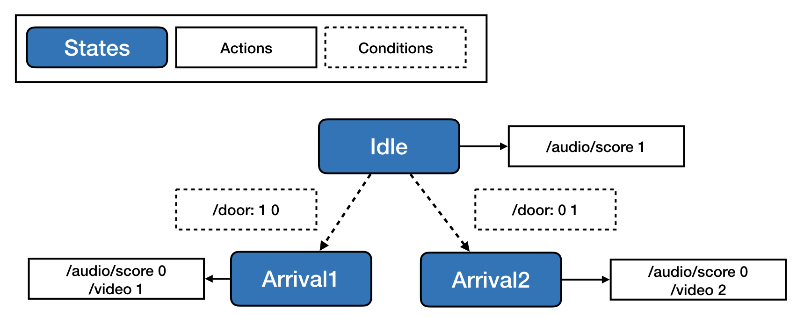
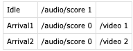

# Max/MSP-State-Machine

This system allows for flexible implementation of state machine logic for controlling audio/video playback and IoT devices using Open Sound Control (OSC) messaging in the Max/MSP environment. State machine logic is implemented Javascript code which runs within Max's `[js]` blocks. 

The state machine integrates easily with additional Javascript code designed to simplify and standardize control of Max's `[sfplay~]` and `[jit.movie]` blocks for audio and video playback, respectively. 

This documentation assumes some familiarity with Max/MSP, OSC, and basic Javascript.

## Installation
1. Download this library using the green button near the upper right corner of this page (Clone or Download->Download Zip) 
2. Move the `libsm` directory to your Max 8 libraries folder
	*  **In OS X**: `/User/Documents/Max 8/Library`
	* **In Windows 10** `/Users/My Documents/Max 8/Libraries`

## AssetControl

The Javascript files `audioctrl.js` and `videoctrl.js` are designed for use with Max's `[js]` blocks. Each requires as an argument the name of a sub-directory of assets contained in the same directory as the Max patch. The asset controllers look for WAV and MP4 files, respectively, and assign cue numbers to each file in alphabetical order. This allows playback to be controlled using OSC messages of the formats:

`/[path-to-asset-folder] [cue #] [one-shot/loop]`

and 

`/[path-to-asset-folder] [command] [argument]`

**Example (Video Control):**

The object `[js videoctrl.js /video]` in the provided example controls all assets in the `/video` directory, which contains sub-directories `/video/instruction` and `/video/object` containing two MP4 files each.

* The message `/video/instruction 2` plays the second video file in `/video/instruction`
* The message `/video/object 1 1` starts a loop of the first video file in `/video/object`
* The message `/video gain -20` sets the gain of the video's audio track to -20dB
* See `videoctrl.maxpat` for more control message examples, and an example configuration with `[jit.movie]` and `[jit.world]`
	* Note that `[jit.movie]` must be configured to send a 'loopnotify', or end-of-file (EOF) message, which must be routed to the left inlet of `[js videoctrl.js]` so that EOF events can be correctly formatted an sent to the state machine.

### Audio Control

While the OSC message format for controlling audio file playback is identical to that of the video player, the configuration of the object is slightly different. Whereas `videoctrl.js` is intended to control a single video channel, `audioctrl.js` is able to control multiple audio channels simultaneously by using a dedicated `[sfplay~]` for each channel. 

* If the asset folder provided to `[js audioctrl.js]` contains WAV files only, then the object will create a pair of outlets for controlling an `[sfplay~]` instance, and a `[live.gain~]` slider, respectively.
* If the asset folder contains sub-directories of WAV files, then the object will create a pair of outlets for each sub-directory containing WAVs
	* Each `[sfplay~]` object's right-most outlet must be connected to a message block that sends the channel number back to `[js audioctrl.js]` so that EOF events can be correctly formatted an sent to the state machine. Note this is unnecessary if the state machine does not need to change state based on EOF events from audio files, as video EOF may be more generally useful.
 * See `audioctrl.maxpat` for an example of a two-channel configuration. 


## StateMachine

The state machine system allows implementation of complex, branching logic required for generative experiences. Its operation is based on OSC messages which control transitions from state to state. Each state contains associated 'actions', which are also OSC messages which control video and audio playback. 

Implementing the state machine logic requires four steps:
1. Diagramming the state machine logic
2. Defining the states and actions in a spreadsheet `states.csv`
3. Defining the possible transition conditions in another spreadsheet `conditions.csv`
4. Implementing the transition logic in Javascript

This library includes a file `main_template.js` which calls the state machine back-end and handles incoming OSC messages. You will need to modify this template and instantiate it in Max using a `js` block, providing a path to a directory containing your two CSV files. For example, the block `[js main_template.js /sm]` looks in the directory `/sm` for `states.csv` and `conditions.csv`.

### Example 1
For example, we may start in an 'Idle' state, in which we play a background audio track, and when an audience member opens one of two doors equipped with IoT sensors, the sensor may send an OSC message to the state machine which triggers a transition to state 'Arrival1' or 'Arrival2', which stops the background audio and triggers a different video clip for each state.

#### Diagramming the State Machine
The state machine diagram for this example is shown here:



To implement this example using the provided state machine library, you need to specify the states and their associated actions in one CSV file, and the conditions on which you transition between states in another CSV file. These two files should be named `states.csv` and `transitions.csv`, respectively.

#### states.csv
Since we have three possible states, `states.csv` is a spreadsheet with three rows:



Note: rows and columns can be added to `states.csv` as needed to model additional states and output additional OSC messages.

#### conditions.csv
Since we only transition states based on whether one of two doors is open, `conditions.csv` only needs a single row, specifying that a `/door` message can come from one of two sources.


Note: Rows may be added to `conditions.csv` as needed, but it will always have two columns specifying the message path and the number of possible message sources. 

#### Javascript 

To complete the state machine, we need to add some custom Javascript code to the end of `main_template.js`. Whenever the `[js main_template.js]` block receives an OSC message, it looks inside `main_template.js` for a function with the name of the current state, preceded by `update_`. This function takes four arguments:

1. `key`: the OSC path of the most recent message received
2. `idx`: the index in the condition array which was updated by the OSC message
3. `val`: the value in the condition array which was updated by the OSC message
4. `unique`: whether the values in the condition array for this key have occurred before

This function can return nothing to remain in the current state, or return the name of another state to transition to it. 

So a function which allows us to transition from Idle to Arrival1 or Arrival2 based on which door was opened is as follows:

```
function update_Idle(key, idx, val, unique) {
  if (key != '/door') {
  	return;				// Message was not from a door; do nothing
  }
  if (val == 0) {
  	return;				// A door was closed; do nothing
  }
  if (idx == 0) {
  	return 'Arrival1';	// Door 1 was opened; transition to Arrival1
  }
  else if (idx == 1) {
  	return 'Arrival2';	// Door 2 was opened; transition to Arrival2
  }
}
```

In additon, any function with the name of a state preceded by `begin_` or `end_` will be called immediately after transitioning to the state, or immediately before transitioning out of it, respectively. This allows OSC messages to be generated dynamically, based on conditional logic or random number generation when needed. 

See the most recent Max/MSP [documentation](https://docs.cycling74.com/max8/vignettes/javascriptinmax) for the `[js]` block for information on available functions and sending messages to outlets.

### Example 2
See the Keynote/PDF slides, and `StateMachine/main.maxpat` and `StateMachine/main.js` for a full example state machine configuration, which is integrated with the asset controllers. Note this example uses an additional Javascript block `[js avroute.js]`, which routes all OSC messages from the state machine beginning with `/audio` to the audio asset controller, and all messages beginning with `/video` to the video asset controller. 


